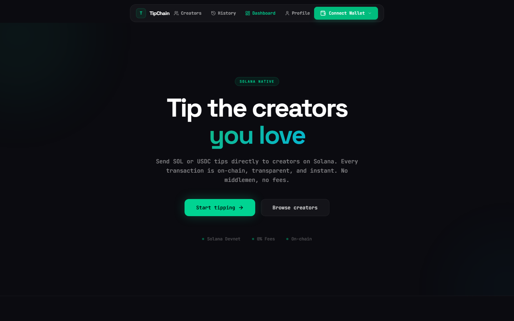
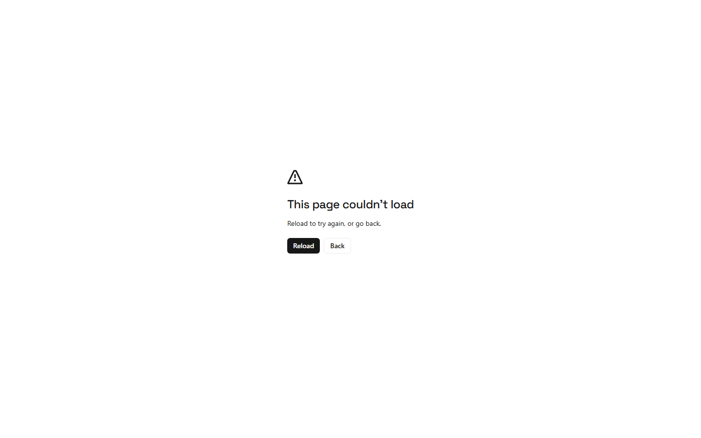
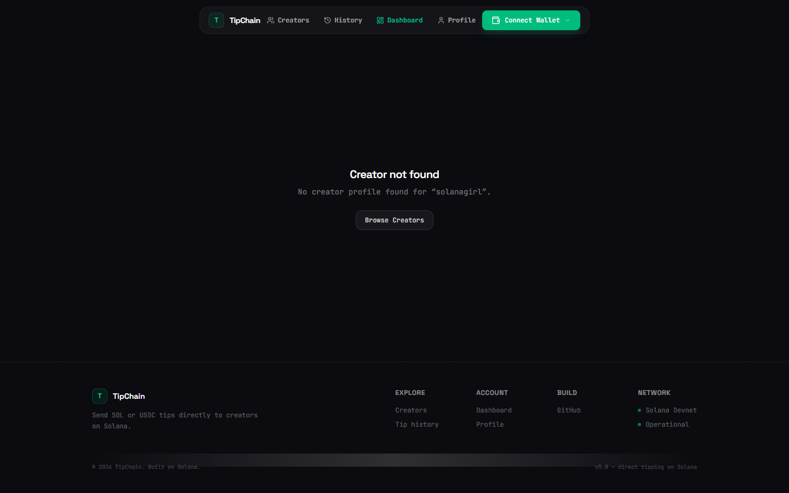

# TipChain 

Send SOL (or USDC) tips to your favorite creators — direct, fast, and on Solana.

## Live

- Web app: https://tipchainsolana.vercel.app

## What it does

- Creator profiles — connect a Solana wallet and create a public profile with a username, bio, avatar, and social links
- Direct tipping — anyone can tip a creator in SOL or USDC with an optional message
- Dashboard — creators see their earnings, supporter count, and recent tips
- History — full send/receive history per wallet with token and date filters
- Leaderboard API — top tippers ranked by amount sent

## Screenshots

Connect a wallet (Phantom or MetaMask via the Solana Snap) to send a tip._

| Home | Creators | Creator profile — Send a Tip |
| --- | --- | --- |
|  |  | 

## Stack

| Layer | Technology |
|-------|-----------|
| Frontend | Next.js, React, TypeScript, Tailwind CSS, shadcn/ui |
| Backend | Node.js, Express, Prisma |
| Database | PostgreSQL (Supabase) |
| Blockchain | Solana (@solana/client, wallet-standard) |
| Hosting | Vercel (frontend + API functions) |

## Repository layout

```
apps/web/       Next.js frontend
backend/        Express + Prisma API
prisma/         Prisma schema (shared)
```

## Local development

```bash
# Backend (API on http://localhost:4000)
cd backend
cp .env.example .env   # add your DATABASE_URL + JWT secrets
npm install
npm run dev

# Frontend (web app on http://localhost:3000)
cd apps/web
npm install
npm run dev
```

### Seeding demo data

```bash
cd backend
npm run seed              # upserts demo creators + sample tips
npm run seed -- --clear   # removes demo data
```
